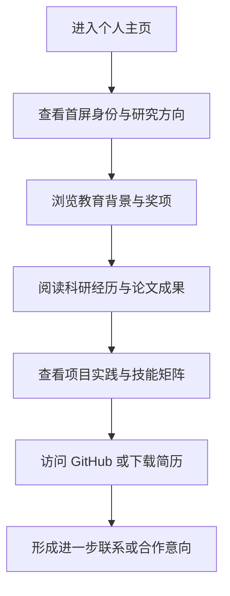

## 1. 产品概述
这是一个基于个人简历信息构建的学术风格个人主页，用于系统展示教育背景、科研经历、项目实践、技能结构与研究兴趣。
- 目标用户为导师、招生老师、实验室研究人员、合作同学与技术社区访客，核心目标是快速建立专业、可信、克制的第一印象。
- 页面采用接近 Claude 的品牌气质：温和浅底、深色正文、低饱和强调色，并结合更强的学术编排感与阅读节奏。

## 2. 核心功能

### 2.1 功能模块
1. **首页**：首屏介绍、研究方向摘要、联系方式、快速跳转导航。
2. **学术履历区**：教育背景、科研经历、论文与合作成果、奖项与导师信息。
3. **项目与技能区**：项目实习、技术栈、研究工具、能力结构。

### 2.2 页面详情
| 页面名称 | 模块名称 | 功能描述 |
|-----------|-------------|---------------------|
| 首页 | Hero 首屏 | 展示姓名、身份、学校、研究方向、简短学术陈述、简历下载与 GitHub 链接 |
| 首页 | 学术概览 | 用精炼卡片展示专业排名、英语能力、奖项与研究兴趣 |
| 首页 | 教育背景 | 展示学校、专业、年级、时间、核心课程与导师信息 |
| 首页 | 科研经历 | 重点展示 GraphLLM、AI-Signaturer、SciAtlas 等经历，突出论文、方法与结果 |
| 首页 | 项目实习 | 展示 GammaGL、机器人抓取、YOLO 无人机识别等项目 |
| 首页 | 技能矩阵 | 按编程、深度学习、图学习、工程工具四类呈现技能 |
| 首页 | 页脚联系区 | 展示邮箱、电话、GitHub 与简历入口 |

## 3. 核心流程
访客进入页面后，首先看到高度概括的个人学术身份与研究方向，然后顺序浏览教育背景、科研成果、项目实践与技能结构，最后通过 GitHub 或简历下载进入更深层的了解。整体流程以“建立可信度 -> 展示研究能力 -> 展示工程能力 -> 提供联系入口”为主线。

## 4. 用户界面设计
### 4.1 设计风格
- 主色调：`#faf9f5` 作为背景，`#141413` 作为正文与标题，`#e8e6dc` 作为浅层分隔背景，`#b0aea5` 作为辅助文本。
- 强调色：以 `#d97757` 为主强调色，`#6a9bcc` 与 `#788c5d` 用于科研标签、链接悬停和轻量视觉区分。
- 字体策略：标题使用 `Anthropic Sans`，正文使用 `Anthropic Serif`，均需配置合理回退字体以保证可用性。
- 按钮风格：低对比描边与浅阴影结合，强调按钮采用暖橙实底，整体避免强商业化按钮样式。
- 布局风格：桌面端采用窄内容学术版式与分节留白，移动端折叠为单列滚动阅读。
- 图形语言：使用细线分隔、论文式编号、轻标签、柔和背景块，避免夸张插画与强动画。

### 4.2 页面设计概览
| 页面名称 | 模块名称 | UI 元素 |
|-----------|-------------|-------------|
| 首页 | Hero 首屏 | 大标题、学术身份副标题、研究方向标签、简历按钮、GitHub 链接、柔和分隔线 |
| 首页 | 学术概览 | 4 个信息摘要卡片，强调排名、语言能力、奖项、研究兴趣 |
| 首页 | 履历内容区 | 学术时间轴、论文条目、项目条目、关键词标签、成果数据 |
| 首页 | 技能矩阵 | 分组标签、轻量边框卡片、技能关键字云 |
| 首页 | 页脚 | 联系方式、版权信息、简历下载入口 |

### 4.3 响应式
- 采用桌面优先设计，适配平板和手机。
- 大屏控制最大阅读宽度，避免学术内容横向过长。
- 小屏下首屏转为单列堆叠，时间轴改为纵向卡片列表。
- 所有交互元素满足触屏点击尺寸要求。
