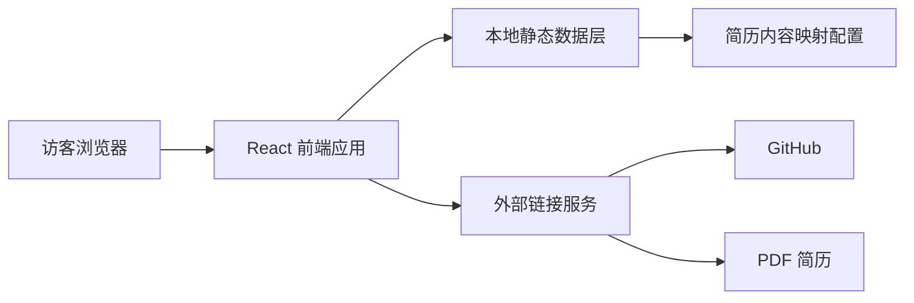

## 1. 架构设计


本项目为纯前端静态个人主页，无需后端与数据库。所有展示内容均来自简历提炼后的本地结构化数据，便于后续维护与迭代。

## 2. 技术描述
- 前端：React 18 + TypeScript + Vite
- 样式：Tailwind CSS 3
- 路由：单页结构，保留 `react-router-dom` 基础能力
- 图标：`lucide-react`
- 数据来源：本地 TypeScript 数据对象，不接入外部 API
- 部署形态：静态站点，可本地预览，也可后续部署到 Vercel 等平台

## 3. 路由定义
| 路由 | 用途 |
|-------|---------|
| `/` | 个人主页主页面，展示完整学术履历与联系信息 |

## 4. 数据定义
项目采用前端本地数据模型，围绕页面区块建立统一类型，便于内容更新。

```ts
type HeroProfile = {
  name: string
  title: string
  institution: string
  summary: string
  interests: string[]
  email: string
  phone: string
  github: string
  resumeHref: string
}

type EducationItem = {
  school: string
  program: string
  location: string
  period: string
  highlights: string[]
}

type ResearchItem = {
  title: string
  role: string
  period: string
  link?: string
  tags: string[]
  bullets: string[]
}

type ProjectItem = {
  title: string
  period: string
  bullets: string[]
}

type SkillGroup = {
  label: string
  items: string[]
}
```

## 5. 组件结构
- `App`：页面装配与整体布局
- `SectionShell`：统一章节容器与标题样式
- `HeroHeader`：首屏简介、按钮与研究兴趣标签
- `StatHighlights`：学术摘要卡片
- `EducationSection`：教育背景区
- `ResearchSection`：科研经历区
- `ProjectSection`：项目实践区
- `SkillsSection`：技能矩阵区
- `SiteFooter`：联系信息与页脚

## 6. 样式系统
- 颜色变量严格参考用户提供的 Anthropic 风格色板：
  - `--color-bg: #faf9f5`
  - `--color-fg: #141413`
  - `--color-muted: #b0aea5`
  - `--color-subtle: #e8e6dc`
  - `--color-accent: #d97757`
  - `--color-accent-blue: #6a9bcc`
  - `--color-accent-green: #788c5d`
- 标题字体族：`"Anthropic Sans", "Poppins", Arial, sans-serif`
- 正文字体族：`"Anthropic Serif", "Lora", Georgia, serif`
- 动效策略：仅保留轻微淡入、悬停阴影与链接下划线动画，避免破坏学术阅读感。

## 7. 实现要点
- 将简历内容转为结构化常量文件，避免硬编码散落在多个组件中。
- 用时间轴与分节排版突出科研与项目的先后关系。
- 强调论文、合作实验室、成果指标与竞赛奖项，弱化花哨展示。
- 保持高可读性和良好的文本层级，桌面端控制在舒适阅读宽度内。

## 8. 测试与验证
- 运行 `npm run check` 进行类型与构建检查。
- 启动本地开发服务器进行视觉验收。
- 使用浏览器快照确认字体回退、布局层级、按钮链接和响应式表现。
